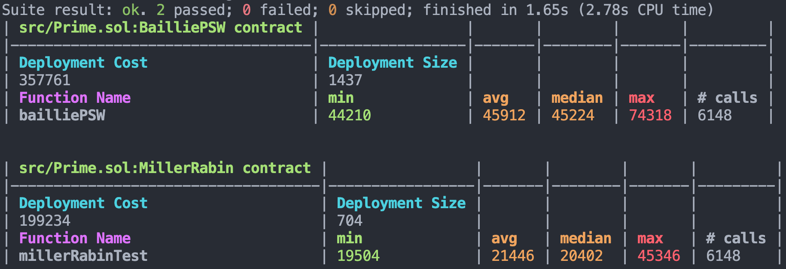

# Getting Started

## Directory Structure

<pre>
├── lib: Contains dependencies managed as Git submodules.
├── src: The main directory for all the contracts.
├── test: Includes Pietrzak.t.sol, Wesolowski.t.sol and Prime.t.sol for generating JSON files and printing the results on console.
│   ├── shared: Contains test cases for the Pietrzak VDF, Wesolowski VDF and Prime Test, utility function contracts.
</pre>

## Install

```
make install
```

## Build

```
make build
```

## Test

```
make test
```

This test command generates the following JSON files:

- Pietrzak2048GasUsed.json
  - Contains the results of gasUsed measurements for 2048-bit data sizes. The `tau` values between 20 and 25, across 5 different test cases for each case.
- Pietrzak3072GasUsed.json
  - Contains the results of gasUsed measurements for 3072-bit data sizes. The `tau` values between 20 and 25, across 5 different test cases for each case.
- PietrzakCalldataLength_IntrinsicGas.json
  - Contains the results of measuring the calldata length and intrinsic gas for 2048-bit and 3072-bit data sizes of Pietrzak VDF. The `tau` values between 20 and 25, across 5 different test cases.
- Wesolowski2048And3072.json
  - Contains the results of gasUsed, calldata length and intrinsic gas for 2048-bit and 3072-bit data sizes. The `tau` values between 20 and 25, across 5 different test cases for each case.

This test command also prints the result of Prime Test:


